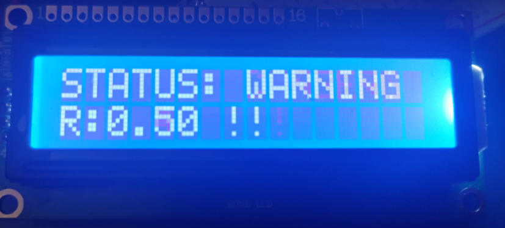

📟 hd44780-i2c-nostd
🦅 Version v0.2.1
A Robust, High-Performance HD44780 Driver for Rust (no_std). Optimized for Embassy and embedded systems like RP2040 (Pico), Pico 2, STM32, and ESP32.

🛡️ Hardware Resilience & Self-Healing (v0.2.1)
The most significant update in version 0.2.1 is the introduction of a resilient communication layer designed for long-running embedded systems.

The "Garbage Data" Problem
Standard HD44780 drivers often suffer from "LCD corruption" or "hieroglyphs." This happens when the display loses power or is physically disconnected. Upon reconnection, the LCD resets to its default 8-bit mode, while the microcontroller continues sending data in 4-bit mode. This mismatch results in unreadable characters and requires a manual system reset.

The Solution: safe_send logic
This crate solves this by wrapping I2C transactions in a Self-Healing loop:

Detection: Every command monitors the I2C bus for NACK errors or communication failures.

Auto-Recovery: If a failure is detected, the driver assumes a hot-plug event or power glitch occurred and automatically re-triggers the 4-bit initialization sequence.

Seamless Resumption: The original data is then re-transmitted, ensuring the user sees the correct output without any manual intervention or re-flashing.

> [!NOTE]
API Change: To support this "Always-On" reliability, public methods such as write_str, set_cursor, and clear now require a delay argument. This ensures the driver can respect hardware timings during an automatic recovery event.

Created by Jorge Andre Castro.

🛡️ The Mission
hd44780-i2c-nostd provides a reliable way to drive classic LCD displays via the PCF8574 I2C expander. This crate is licensed under GPL-2.0-or-later to ensure that fundamental hardware drivers remain a common good and are never locked away in proprietary blobs.

🚀 Key Features
True Async Native: Built from the ground up for embedded-hal-async. No blocking loops, no CPU wastage.

Zero-Copy Efficiency: Optimized I2C transactions. We pulse the Enable pin by grouping High/Low states in a single buffer to saturate the bus efficiently.

no_std & Bare-Metal: Perfect for Embassy, RTIC, or custom kernels. Zero dependency on the standard library.

Anti-Glitch Initialization: Implements the official HD44780 4-bit initialization sequence with precise hardware delays to ensure a "Clean Boot" every time.

Flexible Layouts: Supports 16x2, 20x4, and other standard character LCD geometries.

📋 Changelog & Updates
🦅 Version 0.1.2
Feature: Full asynchronous support via I2c and DelayNs traits.

Feature: Integrated Cursor Management and Backlight control.

Optimization: Single-transaction nibble writing to reduce I2C overhead.

🛠️ Usage
Installation

Ini, TOML
[dependencies]
hd44780-i2c-nostd = "0.1.2"

💡 Quick Start
Rust
use hd44780_i2c_nostd::LcdI2c;
use embassy_time::Delay;

// 1. Initialize your I2C peripheral (Embassy RP2040 example)
// let i2c = I2c::new(p.I2C0, p.PIN_1, p.PIN_0, Irqs, Config::default());

// 2. Create the LCD instance (Address 0x27 is common)
let mut lcd = LcdI2c::new(i2c, 0x27);

// 3. Initialisation with a delay provider
lcd.init(&mut Delay).await.unwrap();

// 4. Write your data (don't forget the delay argument!)
lcd.set_cursor(0, 0, &mut Delay).await.ok();
lcd.write_str("Project of my life", &mut Delay).await.ok();

// 5. Toggle Backlight
lcd.set_backlight(true);
🎮 Example: Real-time Telemetry
Rust
// In your main loop, display PID data or sensor values
loop {
    let temp = sensor.read_temp().await;
    lcd.set_cursor(1, 0, &mut Delay).await.ok();
    
    // Pro-tip: use core::fmt with a small buffer for dynamic strings
    let mut buf = [0u8; 16];
    if let Ok(s) = format_no_std(&mut buf, format_args!("Temp: {:.2}C", temp)) {
        lcd.write_str(s, &mut Delay).await.ok();
    }
    
    Timer::after_millis(500).await;
}
⚖️ License
This project is licensed under the GNU General Public License v2.0 or later.

You are free to use it, but the freedom of the code must be respected. Any improvements made to this driver MUST be shared back with the community.

🦅 Why use this?
Because in the "Project of your life", you cannot afford a driver that hangs or uses legacy blocking code. hd44780-i2c-nostd is designed to be the invisible, robust bridge between your logic and your user interface.